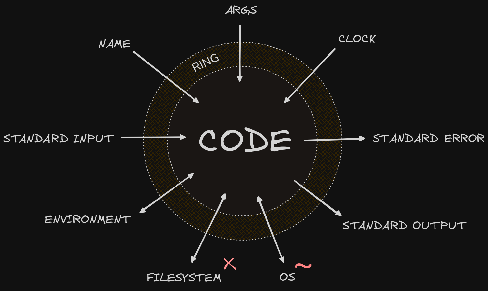

[](https://goreportcard.com/report/github.com/ctx42/ring)
[](https://pkg.go.dev/github.com/ctx42/ring)
[](go.mod)
[](https://github.com/ctx42/ring/actions/workflows/go.yml)
[](LICENSE.md)

# ring

A program execution context for CLI commands and their tests.



The `ring` package provides utilities to manage a program's execution context,
enabling dependency injection for standard I/O streams, environment variables,
arguments, and time. By avoiding reliance on global state (e.g., `os.Stdin`,
`os.Environ`), it simplifies testing and improves code modularity.

<!-- TOC -->
* [ring](#ring)
  * [Key Features](#key-features)
  * [Prerequisites](#prerequisites)
  * [Installation](#installation)
  * [Usage](#usage)
    * [Production Code](#production-code)
    * [Test Code](#test-code)
    * [Metadata](#metadata)
    * [Subcommand Context](#subcommand-context)
    * [Deterministic Time](#deterministic-time)
<!-- TOC -->

## Key Features

- **Dependency Injection**: inject custom standard I/O streams, environment
  variables, program name, arguments, a clock, and a read-only filesystem.
- **Test-Friendly**: simplifies mocking of global dependencies for unit tests.
- **Metadata Support**: store and manage arbitrary key-value metadata.

## Prerequisites

Go 1.26 or newer.

## Installation

To use `ring` in your project, add it as a dependency:

```shell
go get github.com/ctx42/ring
```

## Usage

The `ring` package centers around the `Ring` type, which encapsulates a
program's execution context.

### Production Code

```go
package main

import (
	"fmt"

	"github.com/ctx42/ring/pkg/ring"
)

func main() {
	rng := ring.New()
	fmt.Fprintf(rng.Stdout(), "%s\n", rng.Name())
}
```

`ring.New` with no options uses:

- standard I/O: `os.Stdin`, `os.Stdout`, and `os.Stderr`
- environment: `os.Environ`
- clock: `NowUTC`
- arguments: `os.Args[1:]` when `os.Args` is non-empty, otherwise nil
- name: `os.Args[0]` when present, otherwise empty
- metadata: an empty map
- filesystem: no access

### Test Code

Use a buffer for stdout to capture and verify program output without
touching `os.Stdout`:

<!-- gmmce:pkg/ring/ExampleNew_inTest -->
```go
// greet simulates a CLI function that writes to the ring's stdout.
greet := func(rng *ring.Ring) {
	name := rng.EnvGet("USER_NAME")
	_, _ = fmt.Fprintf(rng.Stdout(), "Hello, %s!\n", name)
}

var sout bytes.Buffer
rng := ring.New(
	ring.WithEnv([]string{"USER_NAME=Alice"}),
	ring.WithArgs([]string{"--verbose"}),
)
rng.SetStdout(&sout)

greet(rng)

_, _ = fmt.Print(sout.String())
// Output:
// Hello, Alice!
```

`github.com/ctx42/ring/pkg/ring/ringtest` builds a `Ring` on buffers for
tests. `ringtest.New` takes the test and returns a `Tester`. `Tester.Ring`
rebuilds the context with those buffers.

### Metadata

`Ring` carries an arbitrary `map[string]any` that subcommand handlers
can read and write without extra function parameters:

<!-- gmmce:pkg/ring/ExampleRing_MetaSet -->
```go
rng := ring.New()
rng.MetaSet("trace-id", "abc-123")

_, _ = fmt.Println(rng.MetaGet("trace-id"))
// Output:
// abc-123
```

### Subcommand Context

`Clone` produces a subcommand context with its own environment and
argument slice. The metadata map, the filesystem, and the standard
streams are shared — a parent command can set a trace ID once and every
clone sees it:

<!-- gmmce:pkg/ring/ExampleRing_Clone -->
```go
parent := ring.New()
parent.MetaSet("trace-id", "xyz-789")

child := parent.Clone()
child.SetArgs([]string{"--verbose"})

_, _ = fmt.Println(child.Args())
_, _ = fmt.Println(child.MetaGet("trace-id"))
// Output:
// [--verbose]
// xyz-789
```

### Deterministic Time

Inject a fixed clock to make time-dependent code produce stable output
in tests:

<!-- gmmce:pkg/ring/ExampleWithClock -->
```go
fixed := time.Date(2024, 1, 15, 12, 0, 0, 0, time.UTC)
rng := ring.New(ring.WithClock(func() time.Time { return fixed }))

_, _ = fmt.Println(rng.Clock()().Format(time.DateOnly))
// Output:
// 2024-01-15
```
