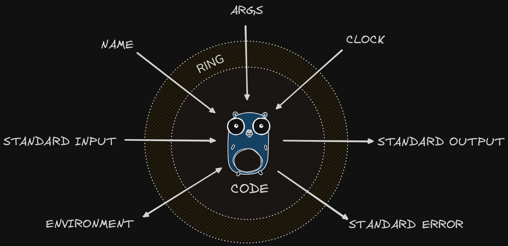

[](https://goreportcard.com/report/github.com/ctx42/ring)
[](https://pkg.go.dev/github.com/ctx42/ring)


<!-- TOC -->
* [The `ring` Package](#the-ring-package)
* [Key Features](#key-features)
* [Installation](#installation)
* [Usage](#usage)
  * [Production Code](#production-code)
  * [Test Code](#test-code)
<!-- TOC -->

# The `ring` Package

The `ring` package provides utilities to manage a program's execution context,
enabling dependency injection for standard I/O streams, environment variables,
arguments, and time. By avoiding reliance on global state (e.g., `os.Stdin`, 
`os.Environ`), it simplifies testing and improves code modularity.



# Key Features

- **Dependency Injection**: inject custom standard I/O streams, environment variables, program name, arguments, and a clock.
- **Test-Friendly**: simplifies mocking of global dependencies for unit tests.
- **Metadata Support**: store and manage arbitrary key-value metadata.

# Installation

To use `ring` in your project, add it as a dependency:

```shell
go get github.com/ctx42/ring
```

# Usage

The `ring` package centers around the `Ring` type, which encapsulates a 
program's execution context. Below are examples demonstrating its core 
functionality.

## Production Code

Production code example.

```go
package main

import (
    "context"
    "os"

    "github.com/ctx42/ring"

    "github.com/user/project/cmd"
)

func main() {
    // Default Ring:
    //  - Standard I/O: [os.Stdin], [os.Stdout], [os.Stderr]
    //  - Environment: [os.Environ]
    //  - Clock: [NowUTC]
    //  - Args: os.Args[1:]
    //  - Name: os.Args[0]
    //  - Metadata: empty map
    //  - Filesystem: none
    rng := ring.New(ring.WithFS(os.DirFS("some/path")))

    ctx := context.Background()
    
    exitCode := cmd.Main(ctx, rng) // Call the real application entrypoint.
    os.Exit(exitCode)
}
```

This way the `cmd.Main` becomes really easy to test. 

## Test Code

Use [StdIO] to manage standard I/O streams, ideal for testing:

```go
package cmd

import (
    "bytes"
    "testing"
    "time"

    "github.com/ctx42/ring"
    "github.com/ctx42/testing/pkg/assert"
    "github.com/ctx42/testing/pkg/iokit"
)

func Test_ProgramOutput(t *testing.T) {
    // --- Given ---
    var sout bytes.Buffer // Create a buffer to capture output.
    clock := iokit.ClockFixed(time.Date(2000, 1, 2, 3, 4, 5, 6, nil))
    rng := ring.New(
        ring.SetStdout(&sout), // Set custom standard output.
        ring.WithEnv([]string{"KEY=value"}), // Inject environment.
        ring.WithArgs([]string{"-pint", "KEY"}), // Set program arguments.
        ring.WithClock(clock), // Inject clock.
        ring.WithFS(os.DirFS("testdata/fs")), // Inject test filesystem.
    )

    // --- When ---
    have := Main(t.Context(), rng) // Run a program.

    // --- Then ---
    assert.Equal(t, 0, have)                // Test exit code.
    assert.Equal(t, "value", sout.String()) // Test standard output.
}
```
